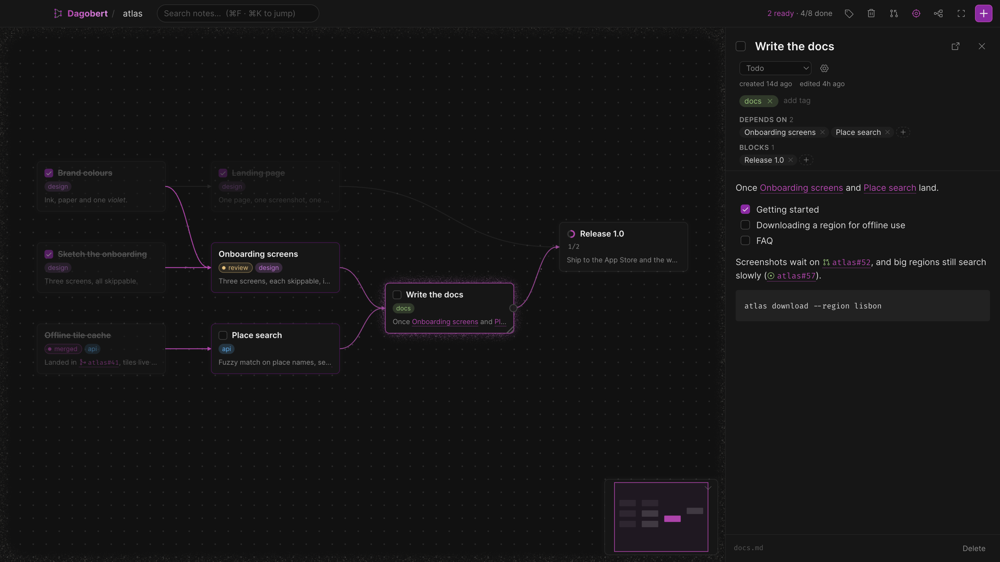

# Dagobert

A lightweight note-taking and task-tracking app where notes form a DAG. Each note is also a task: it can depend on other notes, and it is "ready" once everything it depends on is done.



This is a personal project! It is Obsidian inspired (each file is a local Markdown file), but with a focus on task management, and to fit my own needs.

> [!NOTE]
> This is a work in progress. It is also mostly LLM assisted because I don't want to spend too much time making the app, I'd rather just use it!
> Contributions of any kind are welcome :3

## Tasks

There are several types of tasks:

- Regular "to-do", which is just a note you can check as done.
- Tracking tasks, whose progress is derived from the progress of their dependencies (they can't be marked as done manually).
- Any other format you need! The app lets you define a task format with whatever steps you need. For instance, a "PR" task with "todo", "review", "review-comments".

## Syncing between machines

Turn on **File → Enable git tracking** (the folder must be a git repository; the app offers to
create one). Notes are then committed every few minutes, on `⌘S`, and when the app quits; with
an `origin` remote they are pulled and pushed too, and conflicting edits are merged automatically.

## Releases

Bump with `npm run version -- X.Y.Z` and push to `main`; CI publishes a GitHub release
with macOS DMGs (unsigned — right-click → Open on first launch).

## Development

```sh
npm install
npm run tauri dev     # desktop app
npm run dev           # UI only, in a browser (in-memory backend)
npm run check         # svelte-check
cargo test --manifest-path src-tauri/Cargo.toml
npm run tauri build   # release bundle
npm run install:app   # build + replace /Applications/Dagobert.app + relaunch
```
